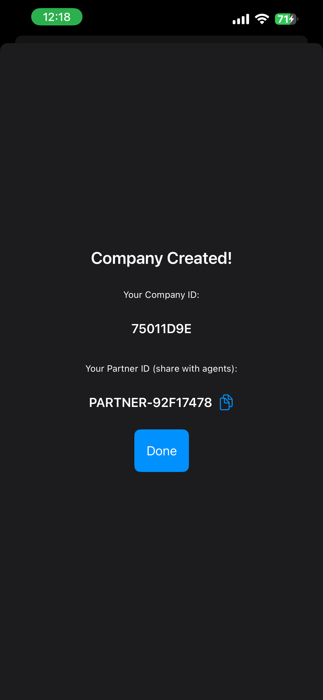
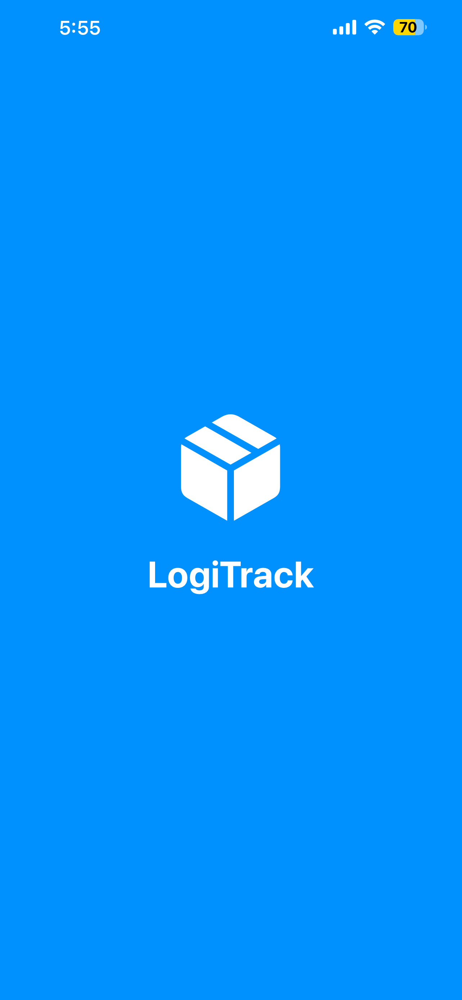
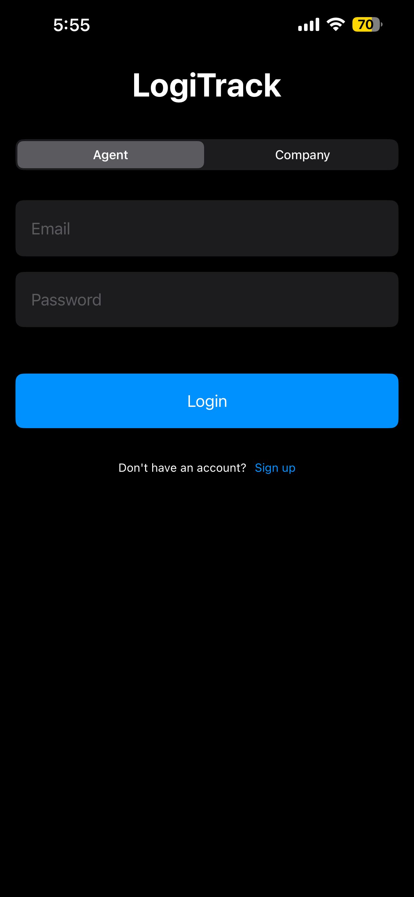
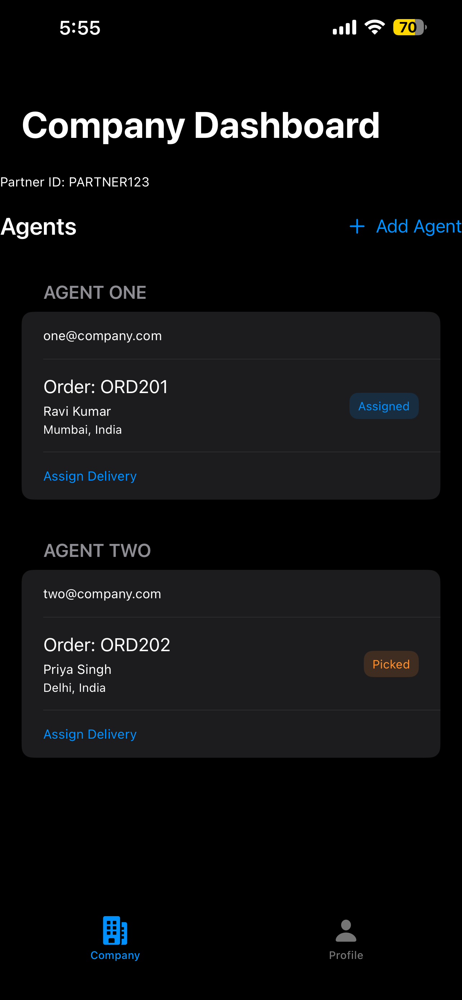
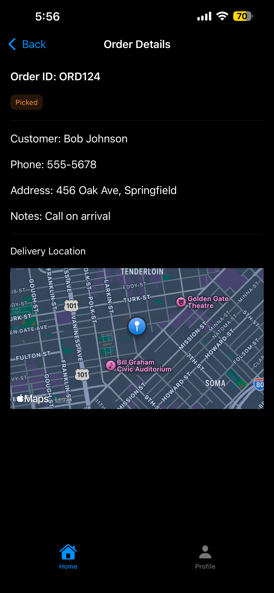

# 🚚 LogiTrack 

**LogiTrack Lite** is a lightweight, SwiftUI-based iOS logistics tracking app designed for delivery agents. It simulates a real-world delivery platform using only free-tier Firebase services and Apple-native frameworks. Agents can view orders, update statuses, share live location, and visualize optimized routes — all in real time.

---

## 🔍 Overview

- 🔐 Firebase Authentication for secure agent login  
- 📦 Real-time delivery order tracking via Firestore  
- 📍 Live location sharing using CoreLocation  
- 🗺️ Route visualization with Apple Maps (MapKit)  
- 🔔 Push notifications via Firebase Cloud Messaging (FCM)

---

## 📸 App Screenshots

| Splash Screen | Login View | Company Creation |
|---------------|------------|------------------|
|  |  |  |

| Company Dashboard | Order Details |
|-------------------|----------------|
|  |  |

---

## ⚙️ Features

- **Order Management** – View all assigned delivery orders  
- **Status Updates** – Update order statuses: `Pending`, `In Transit`, `Delivered`  
- **Live Location Sharing** – Real-time location updates via Firestore  
- **Route Visualization** – Native MapKit route display to destination  
- **Push Notifications** – Receive alerts using FCM  
- **Modular UI** – Clean, reusable SwiftUI components  
- **Offline-Safe** – Firestore persistence with background sync

---

## 🧰 Tech Stack

- **Language:** Swift  
- **Framework:** SwiftUI  
- **Backend:** Firebase (Authentication, Firestore, Cloud Messaging)  
- **Location Services:** CoreLocation  
- **Maps:** MapKit  

---

## 🔧 Installation

1. **Clone the Repository**
    ```bash
    git clone <repository_url>
    cd <project_directory>
    ```

2. **Open in Xcode**  
   Use **Xcode 13+**. Dependencies managed via **Swift Package Manager (SPM)**.

3. **Firebase Configuration**
   - [Create a Firebase project](https://console.firebase.google.com/)
   - Add a new iOS app to the project
   - Download the `GoogleService-Info.plist` file
   - Add it to the Xcode project root
   - Enable:
     - Firebase Authentication (Email/Password)
     - Firestore Database
     - Firebase Cloud Messaging (FCM)

4. **Build & Run**  
   Run on a real device or simulator to test functionality.

---

## 🚀 Usage Flow

1. **Login or Sign Up**  
   Secure authentication with Firebase

2. **View Orders**  
   Real-time updates of delivery assignments

3. **Update Status**  
   Mark deliveries as `In Transit` or `Delivered`

4. **Track Route**  
   Visualize delivery path using MapKit

5. **Share Location**  
   Send live location updates to Firestore backend

6. **Receive Notifications**  
   Alerts about new orders via FCM

---

## 🧠 What This Demonstrates

- Scalable mobile logistics UI/UX using SwiftUI
- Integration of real-time Firestore data with SwiftUI views
- Apple-native map routing with CoreLocation and MapKit
- Firebase Authentication and push notifications setup
- Accessibility-friendly design with modular architecture

---

